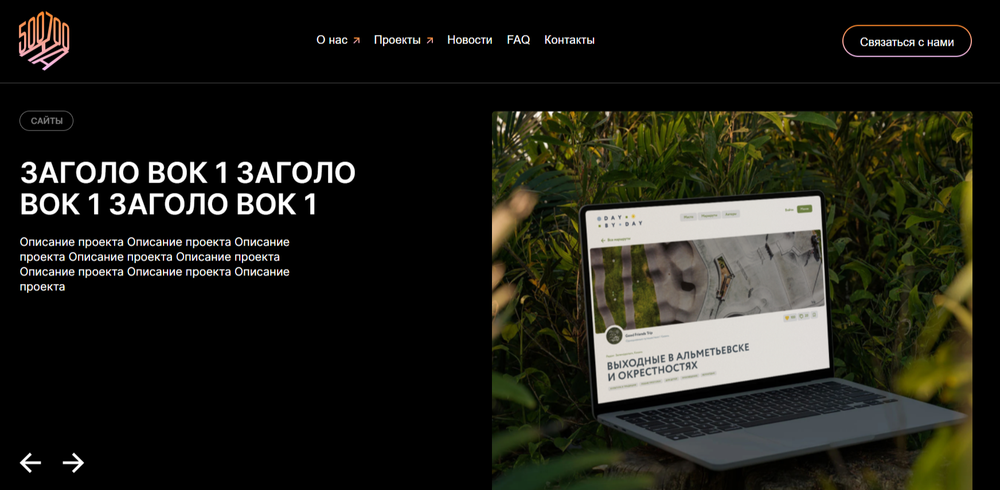

# Webpack Инструкция по развертыванию:

1. npm i

2. npm run build 

3. npm run dev

# Проект: Тестовое задание

## Шаблоны приложения:

## Дизайн:
## [Открыть страницу](https://www.figma.com/file/FrRpHmdcQd9wgCGXFQJp6f/Тестовое-задание-для-разработчика?type=design&node-id=0-1&mode=design&t=Cj3id6a6mZCtfNmu-0)

### Используемые инструменты.

+ Flexbox
+ Webpack
+ БЭМ
+ Grid
+ Js
+ Swiper

#### Чем можно дополнить:

1. Уменьшить вес картинок.
2. Добавить модульный css
3. Улучшить адаптивность
4. Поправить бургер меню
5. Сделать слайдер новостей
